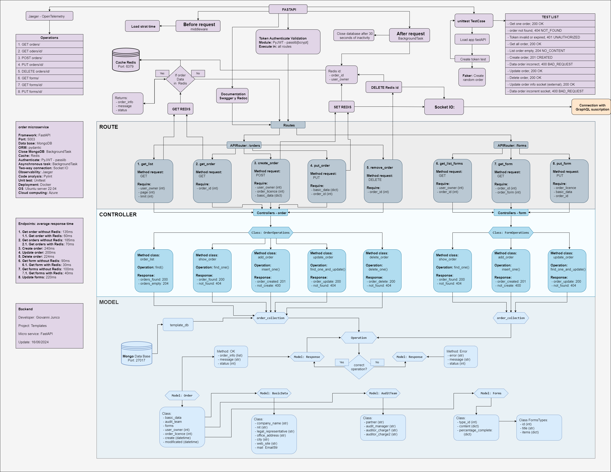

# FastAPI Template

The best framework for creating REST APIs in python due to its agility


the best framework for creating REST APIs in python due to its agility
among the main advantages of FASTAPI are: automatic documentation, asynchronous request, manage errors, full support for pydantic models, file processing and security protocols

## General diagram


## Specific diagram


## Environment Variables

To run this project, you will need to add the following environment variables to your .env file (root folder)

`ENVIRONMENT`
`SECRET_KEY`

`IP_REDIS`
`PORT_REDIS`

`IP_USERS`
`IP_LICENSES`
`IP_ORDERS`
`IP_UPLOAD_FILES`
`IP_NOTIFICATIONS`


## Installation

Install project with python and virtualenv

Linux
```bash
virtualen .fast_api
source .fast_api/bin/activate
pip3 install -r requirements.txt
uvicorn main:app --host 0.0.0.0 --port 5003 --reload
```

Windows
```bash
python -m venv .fast_api
.fast_api\Scripts\activate
pip install -r requirements.txt
uvicorn main:app --host 0.0.0.0 --port 5003 --reload
```

## mongodb

https://docs.pydantic.dev/latest/concepts/fields/#field-aliases
https://www.mongodb.com/developer/languages/python/python-quickstart-fastapi/

Show data base:
```bash
 show dbs
```

See which base I am located on:
```bash
 db
```

Create user for the database
```bash
use admin
db.createUser({ user: "orderadmin", pwd: "tu_password", roles: [{ role: "userAdminAnyDatabase", db: "admin" }, "readWriteAnyDatabase"]});

use order_auditando

db.orders.insert({ userOwner: 1,
            orderLicense: 2,            
            OrderData: {'':''},
            AuditTeam: {'':''}  ,          
            Forms: {'':''},            
            createdAt: '10/10/2014',
            modificated: '10/10/2024'})
```

Create backup and restore
```bash
 mongodump --db order_mongodb_auditando 

 mongorestore --db order_mongodb_auditando dump/order_mongodb_auditando
 
 db.dropDatabase()
```

Basic operations
```bash
db.orders.find()

db.orders.find({userOwner:1}, {Forms: false, modificated:false})

db.orders.remove({_id:  ObjectId('64d52f0a5752413aa02e3c3d')})
db.orders.update({_id:ObjectId('5f6f4cd960f3d9617d59dbc7')},{$set:{dvAY:'1'}});
```

## redis

Redis (Remote Dictionary Server) is an open source NoSQL in-memory data store primarily used as an application cache or database

### Ubuntu install 

https://redis.io/docs/latest/operate/oss_and_stack/install/install-redis/install-redis-on-windows/

```bash

curl -fsSL https://packages.redis.io/gpg | sudo gpg --dearmor -o /usr/share/keyrings/redis-archive-keyring.gpg

echo "deb [signed-by=/usr/share/keyrings/redis-archive-keyring.gpg] https://packages.redis.io/deb $(lsb_release -cs) main" | sudo tee /etc/apt/sources.list.d/redis.list

sudo apt-get update
sudo apt-get install redis

sudo service redis-server start
redis-cli 
ping
PONG
```

### Windows install 

[Releases · microsoftarchive/redis (github.com)](https://github.com/microsoftarchive/redis/releases)
Download and unzip Redis-x64-3.0.504.zip
Place an environment variable path path where it is unzipped

```bash
Strat redis on windows cmd: redis-server

Get data: redis-cli  get Gioabcd123

Clear:  flushall  or flushall async

Get all: todo scan 0
```

## swagger

FatsAPI brings built-in swagger

Automatic interactive API documentation, including 2 alternative user interfaces:

Swagger UI.
    http://127.0.0.1:5003/docs

ReDoc.
    http://127.0.0.1:5003/redoc

## Docker

### Basic

**Python (require dockerfile in root folder):** docker build -t graphql:v1 .

**Redis:**
docker pull redis
docker run --name some-redis -p 6379:6379 -d redis

**MongoDB:**
docker pull mongo
docker run -it -p27017:27017 --name mongodb -e MONGO_INITDB_ROOT_USERNAME=user -e MONGO_INITDB_ROOT_PASSWORD=password mongo

### Docker compose

**Start (require docker-compose.yml in root folder):** docker compose up

**Delete:**	docker compose down


## Optimization (refactoring and quality standards)

The code quality and scalability depends largely on good development practices such as:
- Unit tests in different cases of operations and possible responses of microservices.
- Code debugging using the 5 Solid principles
- PyLint standards in each of the .py files

### Unittest

Require tets folder with all test queries and mutation files

pytest ./test/__init__.py

### Pylint one file

```bash
pip install pylint
python -m pylint .\app.py
```

### Pylint multiple file

pip install pylint-runner

Exec in root folder: 
pylint_runner

### Monitoring

**End-to-end distributed tracing.** Control of systems based on microservices, ease of analyzing the behavior of an application and thus solving possible errors or problems

## Jaeger

pip install opentelemetry

Docker: Getting Started — Jaeger documentation (jaegertracing.io)

install Jaeger on ubuntu
```bash
docker run --rm --name jaeger   -e COLLECTOR_ZIPKIN_HOST_PORT=:9411   -p 6831:6831/udp   -p 6832:6832/udp   -p 5778:5778   -p 16686:16686   -p 4317:4317   -p 4318:4318   -p 14250:14250   -p 14268:14268   -p 14269:14269   -p 9411:9411   jaegertracing/all-in-one:1.51
```

http://192.168.1.127:16686/


## Security

### Token

https://fastapi.tiangolo.com/tutorial/security/oauth2-jwt/

Set of random characters used to validate user instead of sending username and password

JWT: (json web token) encapsulate and share claims (request features).
 - have digital signature: RFC 7515 - can be generated with symmetric or asymmetric keys
 - encrypted data: contains sensitive data (do not set passwords)

[parts of a token (jwt.io)](jwt.io)


## Additional - use Ubuntu in Windows

Execute power shell as administrator:
wsl --install
restart
  username: miubuntu
  password: dfgh1278% 

## Tech Stack

https://fastapi.tiangolo.com/

https://www.starlette.io/

**Server:** Python, fastapi, uvicorn, socket io, pydantic

**Author:** Giovanni Junco

**Since:** 07-06-2024
